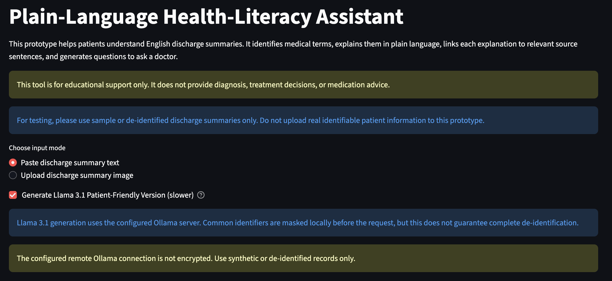
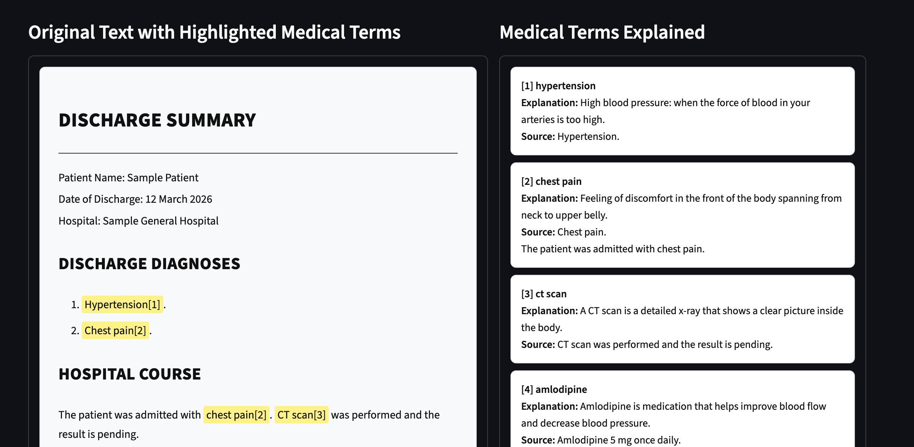
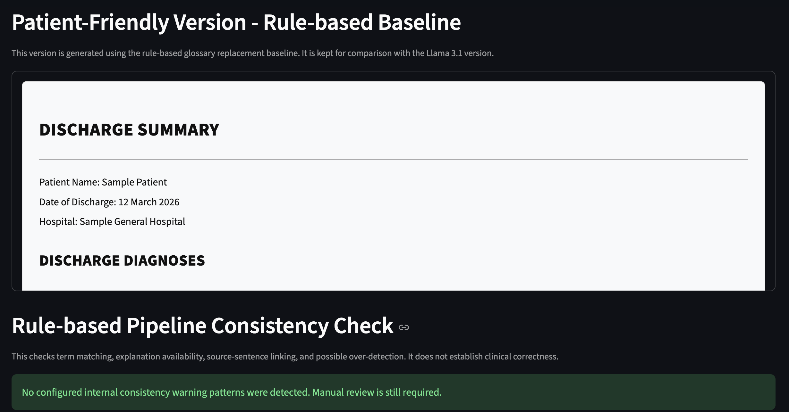
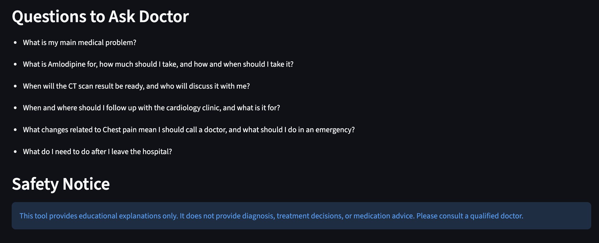

# Plain-Language Health-Literacy Assistant for Patients

An AI-powered web application designed to help non-medical users better understand English hospital discharge summaries.

The system combines OCR, rule-based NLP and large language models to identify medical terminology, provide plain-language explanations, generate a patient-friendly version of the original text, and suggest useful questions patients may ask their doctors.

---

## Website Demo

### Homepage

The web interface allows users to paste an English discharge summary or upload a discharge-summary image. Users can also optionally generate an LLM-based patient-friendly version using Llama 3.1.

### Medical Term Detection and Explanation

Medical terms are highlighted in the original discharge summary and linked to corresponding plain-language explanations and source sentences.

### Rule-Based Patient-Friendly Version

The rule-based baseline generates a simplified version of the discharge summary and performs internal consistency checks for terminology matching and explanation availability.

### Questions to Ask Doctor

The system generates practical questions based on the information in the discharge summary while displaying a clear safety notice that the tool does not provide diagnosis or medical advice.

---

## Project Overview

Hospital discharge summaries often contain medical terminology, abbreviations and professional clinical language that can be difficult for patients without a medical background to understand.

This project explores how AI and NLP techniques can be used to improve the accessibility of discharge information while preserving important medical details.

The application supports both:

- Direct text input
- Medical document image upload

The final prototype is implemented as an interactive Streamlit web application.

---

## Key Features

- **Medical Document OCR**  
  Extracts text from uploaded discharge-summary images using PaddleOCR.

- **Medical Terminology Detection**  
  Identifies medical terms using a curated medical glossary and rule-based matching.

- **Plain-Language Explanations**  
  Provides understandable explanations for detected medical terminology.

- **Patient-Friendly Version**  
  Generates a simplified version of the original discharge summary using both rule-based methods and an optional LLM-based approach.

- **Questions to Ask the Doctor**  
  Generates relevant questions based on information contained in the discharge summary.

- **Rule-Based vs LLM Comparison**  
  Evaluates differences between deterministic rule-based simplification and LLM-generated text.

- **Safety-Oriented Design**  
  Focuses on explaining existing information rather than generating new diagnoses or medical advice.

---

## System Workflow

**Text Input / Medical Document Image**  
↓  
**OCR**  
↓  
**Medical Term Detection**  
↓  
**Plain-Language Explanations**  
↓  
**Patient-Friendly Version**  
↓  
**Rule-Based / LLM-Based Processing**  
↓  
**Questions to Ask Doctor**  
↓  
**Safety Information**

---

## Technology Stack

- Python
- Streamlit
- PaddleOCR
- Natural Language Processing (NLP)
- Rule-Based Text Processing
- Llama 3.1
- Ollama
- Pandas
- Git / GitLab / GitHub

---

## AI and Human Collaboration

AI tools were used throughout the project to support:

- Technical solution exploration
- Prompt design and iteration
- Code debugging
- Alternative implementation analysis
- Test-case design
- Documentation refinement

The core project decisions, including system architecture, feature design, medical-safety boundaries, evaluation strategy and final implementation decisions, were made and validated by me.

LLMs were treated as development and generation tools rather than autonomous decision-makers.

---

## Evaluation

The system has been evaluated through several approaches:

- Batch testing using publicly available discharge-summary data
- Manual functional testing
- OCR testing using medical document images
- Rule-based and LLM output comparison
- User-oriented evaluation of clarity and usability

A dataset of **108 English discharge summaries** was used for batch evaluation.

The evaluation focuses on system functionality, terminology detection, output quality, information preservation and usability rather than clinical effectiveness.

---

### Batch Evaluation Results

The rule-based pipeline was batch-tested on **108 English discharge summaries**.

| Metric | Result |
| --- | ---: |
| Samples processed successfully | **108 / 108 (100%)** |
| Average text length | **2,633 characters** |
| Average unique medical terms detected | **40.0 per summary** |
| Median unique medical terms detected | **37.5 per summary** |
| Average citations generated | **40.0 per summary** |
| Samples generating 6 patient questions | **108 / 108 (100%)** |
| Baseline consistency check passed | **60 / 108 (55.6%)** |
| Samples with warnings | **48 / 108 (44.4%)** |

All 108 discharge summaries completed the end-to-end rule-based pipeline successfully. Each detected medical term was linked to a corresponding citation, and all samples generated six suggested questions for the patient.

The consistency checker flagged **46 samples for possible over-detection** and **2 samples where no glossary terms were detected**. These warnings were retained as part of the evaluation rather than removed, as they highlight an important limitation of dictionary- and rule-based medical term detection on varied clinical text.

---

## Key Challenges

### Medical Information Preservation

Simplifying medical text may unintentionally remove or alter important information.

To reduce this risk, the system is designed to preserve important content such as:

- Diagnoses
- Medication names
- Dosages
- Test results
- Follow-up information

### Long and Complex Clinical Text

Rule-based replacement can become less natural when processing long medical documents, while LLM-generated versions may produce more fluent language but require stronger controls to avoid information omission or over-rewriting.

This project therefore compares both approaches rather than relying entirely on one method.

### OCR Quality

Image quality, document layout and formatting can affect OCR accuracy. OCR output is therefore treated as extracted input that may still require user verification.

---

## My Contribution

This is an independently developed MSc final project.

I was responsible for:

- Problem definition and requirement analysis
- Literature and technology research
- Dataset preparation and analysis
- System architecture design
- OCR integration
- Medical terminology processing
- Rule-based NLP implementation
- LLM integration and prompt design
- Streamlit interface development
- Evaluation design
- Functional testing
- Result analysis

---

## Project Status

The functional Streamlit prototype has been completed and supports the main end-to-end workflow:

**Document Input → OCR → Terminology Detection → Explanation → Patient-Friendly Version → Suggested Questions**

Further work focuses on evaluation, robustness and analysis of limitations.

---

## Important Notice

This project is an academic prototype designed to support understanding of medical information.

It does **not** provide medical diagnosis, treatment recommendations or professional medical advice. Users should consult qualified healthcare professionals when making medical decisions.
